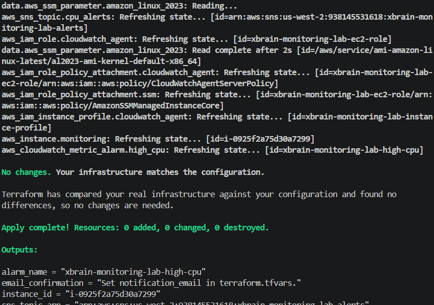
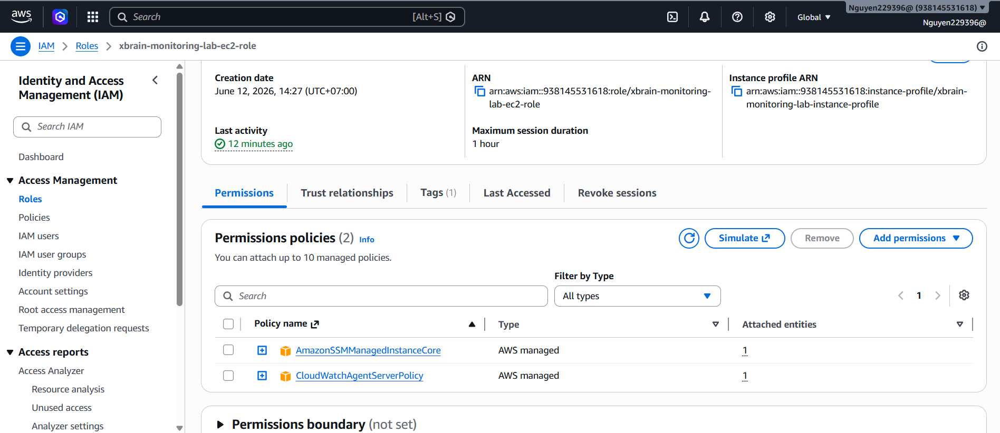
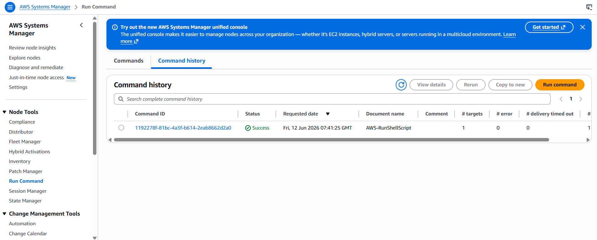
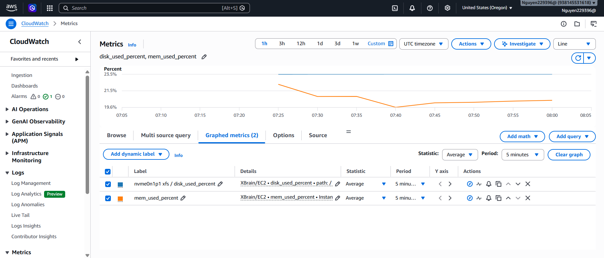

# Lab 2 - Installing the CloudWatch Agent on EC2

Region: `Oregon (us-west-2)`

## Evidence 1 - Terraform Apply

## Evidence 2 - IAM Role Policy

IAM role for EC2 includes the required CloudWatch Agent policy.

## Evidence 3 - CloudWatch Agent Running

CloudWatch Agent status shows `running` and `configured`.

## Evidence 4 - Custom Metrics

Custom namespace `XBrain/EC2` shows memory and disk metrics.

