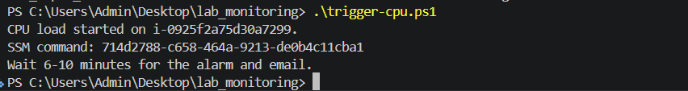

# Lab 3 - CPU Alarm to Email Alert via SNS

Region: `Oregon (us-west-2)`

## Evidence 1 - SNS Email Subscription

SNS email subscription must show protocol `Email` and status `Confirmed`.

Pending screenshot: replace this section with the confirmed SNS subscription
screenshot if required by the submission.

## Evidence 2 - CPU Alarm Configuration

Alarm configuration for `CPUUtilization > 80%`, period `5 minutes`, evaluation
`1 out of 1`, with SNS notification action.

## Evidence 3 - CPU Alarm Triggered

CloudWatch alarm entered `In alarm` state after CPU load test.

## Evidence 4 - SNS Email Alert

Email alert should show alarm name, state `ALARM`, timestamp, and region.

Current screenshot shows the CPU load trigger command. Replace with the SNS email
alert screenshot before final submission if the instructor requires email proof.

