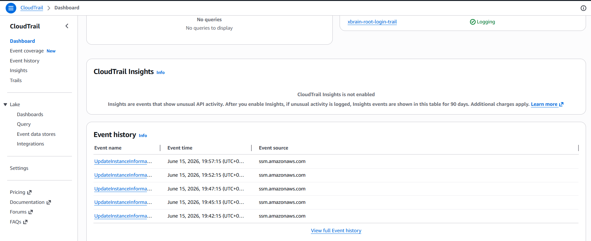
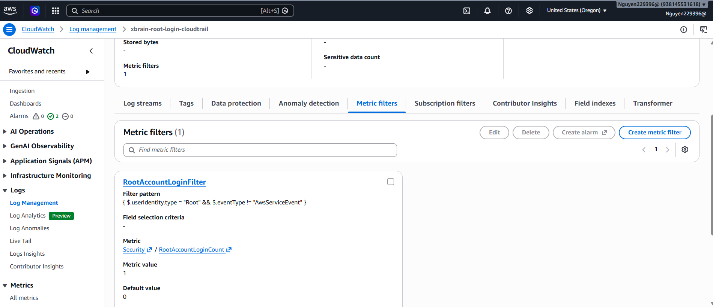
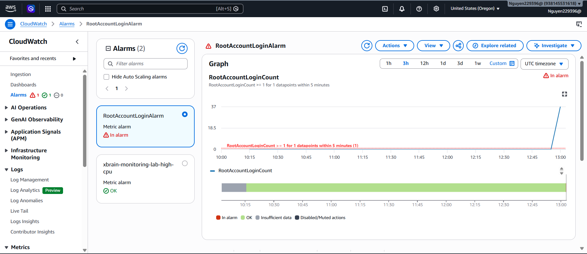
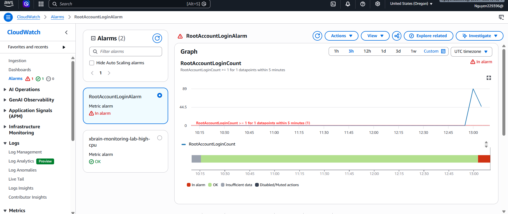

# Lab 4 - Alert on AWS Root Account Login

Region: `Oregon (us-west-2)`

## Evidence 1 - CloudTrail Trail Enabled

CloudTrail trail `xbrain-root-login-trail` is enabled and logging.

## Evidence 2 - Root Login Metric Filter

Metric filter `RootAccountLoginFilter` sends matching root login events to
`Security / RootAccountLoginCount`.

## Evidence 3 - Root Account Login Alarm Configured

Alarm `RootAccountLoginAlarm` monitors `RootAccountLoginCount >= 1` within
`5 minutes`.

## Evidence 4 - Root Login Alarm Triggered

Alarm entered `In alarm` state after root account login event was detected.

## Evidence 5 - Root Login SNS Email Alert

Email alert should show alarm name `RootAccountLoginAlarm`, state `ALARM`,
timestamp, and region.

Current screenshot is another CloudWatch alarm view. Replace `image-11.png` with
the SNS email alert screenshot before final submission if email proof is required.

