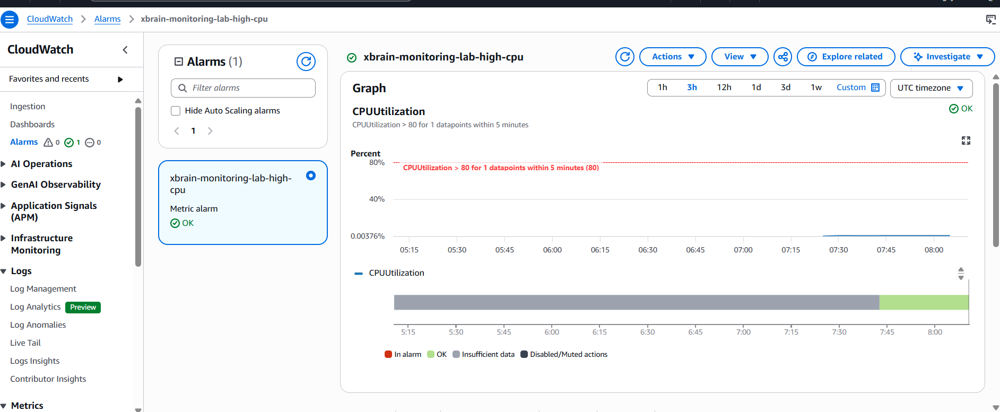
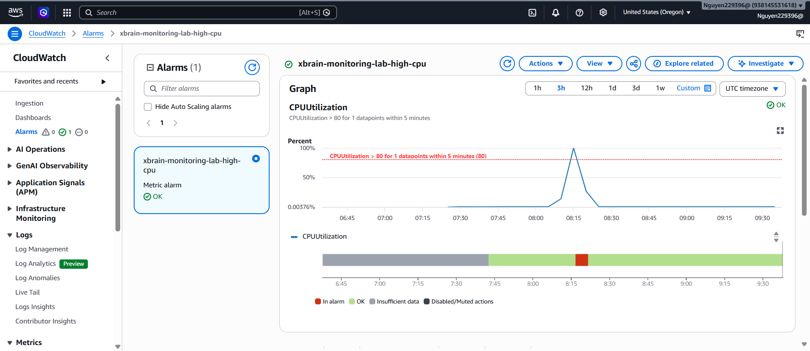

# Evidence Pack

Region su dung: `Oregon (us-west-2)`.

## Lab 1 - CloudWatch Agent

### Evidence 1: Terraform apply

Chay:

```powershell
terraform apply
```


### Evidence 2: IAM policy


### Evidence 3: Agent running

Mo:


Chay lenh status CloudWatch Agent, sau do chup output co:

```json
{
  "status": "running",
  "configstatus": "configured"
}
```

### Evidence 4: Custom metrics


## Lab 2 - CPU Alarm va SNS

### Evidence 5: SNS confirmed

Mo:

`SNS > Subscriptions`

Chup protocol `Email` va status `Confirmed`.

### Evidence 6: Alarm configuration



Danh dau:

- `CPUUtilization`
- Greater than `80`
- Period `5 minutes`
- Evaluation `1 out of 1`
- SNS notification action

### Evidence 7: Alarm triggered

!

Cho 6-10 phut. Chup trang alarm co trang thai do `In alarm` va bieu do CPU vuot
80%.

### Evidence 8: Email alert
[alt text](image-5.png)
Chup email co subject, alarm name, trang thai `ALARM`, timestamp va region.
Che dia chi email ca nhan neu nop cong khai.


